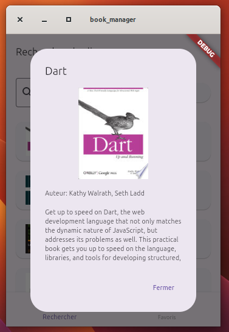

# Rapport de TP : Gestion des Données avec Flutter et SQLite
## Application de Gestion de Bibliothèque Personnelle

### Introduction

Dans le cadre du module de gestion des données, ce projet vise à mettre en pratique les concepts fondamentaux de la persistance des données et de l'intégration d'API REST dans une application mobile. L'objectif principal est de développer une application de gestion de bibliothèque personnelle qui permet aux utilisateurs de rechercher des livres via l'API Google Books et de gérer leurs favoris localement à l'aide de SQLite.

Ce projet illustre plusieurs aspects cruciaux de la gestion des données :
- L'interaction avec une API REST externe (Google Books)
- La persistance locale des données avec SQLite
- La gestion d'état dans une application mobile
- La synchronisation entre les données distantes et locales

# Book Manager App

Une application Flutter pour rechercher et gérer vos livres préférés en utilisant l'API Google Books.

## Table des matières
- [Aperçu](#aperçu)
- [Fonctionnalités](#fonctionnalités)
- [Technologies utilisées](#technologies-utilisées)
- [Installation](#installation)
- [Captures d'écran](#captures-décran)
- [Architecture](#architecture)
- [API](#api)

## Aperçu

Book Manager est une application mobile qui permet aux utilisateurs de rechercher des livres via l'API Google Books, de consulter les détails des livres et de gérer une liste de favoris locale.

## Fonctionnalités

- 🔍 Recherche de livres en temps réel
- 📚 Affichage des détails des livres
- ❤️ Gestion des livres favoris
- 💾 Stockage local avec SQLite
- 🎨 Interface utilisateur Material Design 3

## Technologies utilisées

- Flutter
- Dart
- SQLite
- Google Books API
- HTTP package
- sqflite_common_ffi

## Installation

1. Clonez le dépôt :
```bash
git clone https://github.com/Nadabet/App-de-gestion-de-livres
```

2. Installez les dépendances :
```bash
flutter pub get
```

3. Lancez l'application :
```bash
flutter run
```

## Captures d'écran

### Page d'accueil
.png)

Description : Interface principale de recherche de livres.

### Résultats de recherche


Description : Affichage des résultats de recherche avec images et informations de base.

### Détails du livre


Description : Vue détaillée d'un livre avec description complète.

### Page des favoris
.png)

Description : Liste des livres sauvegardés en favoris.

## Architecture

### Structure du projet
```
lib/
├── database/
│   └── database_healper.dart
├── models/
│   └── book.dart
├── screens/
│   ├── home_page.dart
│   └── favorites_page.dart
├── services/
│   ├── api_service.dart
│   └── db_service.dart
└── main.dart
```
.png)

### Base de données
La base de données SQLite contient une table 'favorites' avec la structure suivante :

```sql
CREATE TABLE favorites (
    id INTEGER PRIMARY KEY AUTOINCREMENT,
    google_id TEXT NOT NULL,
    title TEXT NOT NULL,
    author TEXT,
    image_url TEXT,
    description TEXT
);
```

## API

L'application utilise l'API Google Books avec les endpoints suivants :

- Recherche de livres :
  ```
  GET https://www.googleapis.com/books/v1/volumes?q={search_query}
  ```

### Paramètres de requête
- `q` : Terme de recherche
- `maxResults` : Nombre maximum de résultats (défaut: 40)

## Détails d'Implémentation

### Gestion de l'État
L'application utilise le système de gestion d'état StatefulWidget de Flutter pour :
- Maintenir l'état de la recherche
- Gérer la liste des favoris
- Contrôler l'état de chargement
- Gérer les erreurs

### Performances et Optimisations
1. **Mise en cache des images**
   - Utilisation du cache natif de Flutter pour les images
   - Réduction de la consommation de données

2. **Chargement progressif**
   - Implémentation du lazy loading pour les résultats de recherche
   - Pagination des résultats (40 éléments par page)

3. **Optimisation de la base de données**
   - Indexation de la colonne google_id
   - Utilisation de transactions pour les opérations multiples

### Tests et Qualité du Code
1. **Tests unitaires**
   - Tests des services API
   - Tests des modèles de données
   - Tests des helpers de base de données

2. **Tests d'intégration**
   - Tests de flux de navigation
   - Tests de persistance des données
   - Tests de recherche et favoris

### Difficultés Rencontrées et Solutions

1. **Gestion des erreurs API**
   - Problème : Réponses API inconsistantes
   - Solution : Implémentation d'un système robuste de parsing avec valeurs par défaut

2. **Persistance des données**
   - Problème : Conflits de synchronisation
   - Solution : Utilisation de transactions SQLite et gestion optimiste des conflits

3. **Performance de recherche**
   - Problème : Latence des requêtes API
   - Solution : Mise en place d'un debouncing sur la recherche

### Améliorations Futures

1. **Fonctionnalités**
   - Système de catégorisation des livres
   - Notes et commentaires personnels
   - Synchronisation cloud des favoris
   - Mode hors ligne avancé

2. **Technical**
   - Migration vers une architecture bloc
   - Implémentation de tests E2E
   - Support des thèmes dynamiques
   - Localisation multilingue

## Documentation Technique

### Modèle de Données
```dart
class Book {
  final String? id;        // ID Google Books
  final String title;      // Titre du livre
  final String author;     // Auteur(s)
  final String? imageUrl;  // URL de la couverture
  final String? description; // Description
  final int? dbId;        // ID local SQLite
}
```

### Endpoints API Utilisés
1. Recherche de livres
```
GET /volumes?q={searchTerms}&maxResults=40
```

2. Détails d'un livre
```
GET /volumes/{volumeId}
```

### Schéma Base de Données
.png)

## Contribution

1. Fork le projet
2. Créez votre branche (`git checkout -b feature/AmazingFeature`)
3. Committez vos changements (`git commit -m 'Add some AmazingFeature'`)
4. Push vers la branche (`git push origin feature/AmazingFeature`)
5. Ouvrez une Pull Request

## Licence

Ce projet est sous licence MIT. Voir le fichier `LICENSE` pour plus de détails.

## Contact

Nada bettach - nadabettach6@gmail.com

Lien du projet : https://github.com/Nadabet/App-de-gestion-de-livres

### Conclusion

Ce projet de TP a permis de mettre en œuvre différentes techniques de gestion des données dans un contexte d'application mobile réelle. À travers le développement de cette application de gestion de bibliothèque, nous avons pu explorer et maîtriser :

1. **L'architecture des données** :
   - Conception d'un schéma de base de données local
   - Modélisation des données pour l'API et le stockage local

2. **Les technologies de persistance** :
   - Implémentation de SQLite pour le stockage local
   - Gestion des requêtes et des transactions

3. **L'intégration d'API** :
   - Communication avec une API REST
   - Gestion des réponses et des erreurs
   - Transformation des données JSON

4. **Les bonnes pratiques de développement** :
   - Architecture en couches (services, modèles, UI)
   - Gestion des erreurs et exceptions
   - Documentation du code

Les objectifs du TP ont été atteints, permettant de créer une application fonctionnelle qui démontre la maîtrise des concepts de gestion des données dans un environnement mobile. Les perspectives d'amélioration incluent l'ajout de fonctionnalités comme la synchronisation en temps réel, la gestion des catégories de livres, et l'implémentation d'un système de notes et commentaires.

Ce projet constitue une base solide pour comprendre les enjeux et les solutions liés à la gestion des données dans le développement d'applications mobiles modernes.
